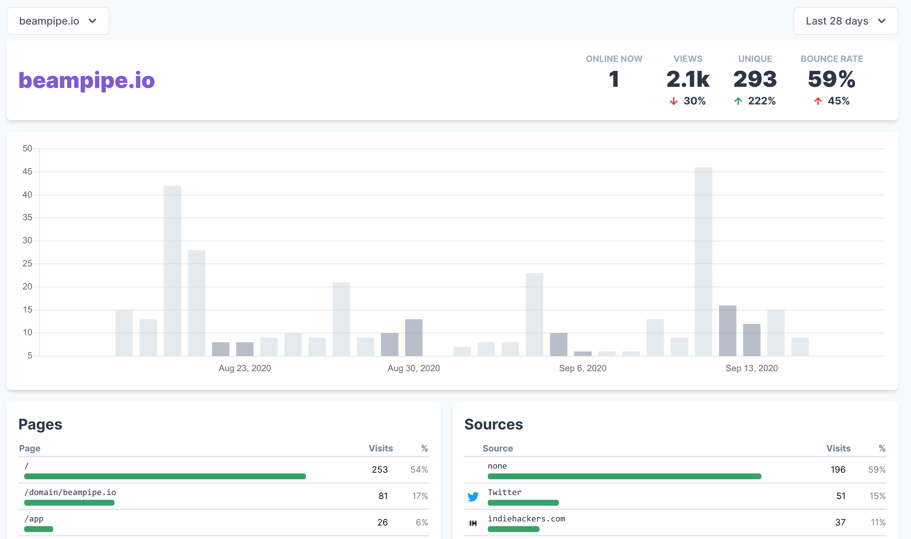

# Beampipe
Beampipe is a simple, open source web analytics tool built on TimescaleDB.  Try
it out at [beampipe.io](https://beampipe.io/). We are currently working on
updating this README and making beampipe easy to self-host.



Beampipe is built and sponsored by [Scalar](https://www.scalar.dev).

## Running beampipe

If you want to have a quick play with beampipe on your local machine, the simplest way is using `docker-compose`:

```
curl https://raw.githubusercontent.com/scalar-dev/beampipe/master/docker-compose.yml -o docker-compose.yml
docker-compose up
```

This will launch both `timescaledb` and `beampipe`. You should be able to access the web UI at `http://localhost:8080`.

Docker images are available on Docker Hub:
- [server](https://hub.docker.com/r/scalardev/beampipe) contains both the server and the UI
- [ui](https://hub.docker.com/r/scalardev/beampipe-ui) is just the UI (served via nginx) e.g. for running in k8s.


## Architecture
Beampipe is designed to be simple and easy to deploy anywhere. The backend is
written in [Kotlin](https://www.kotlinlang.org) using
[Micronaut](https://www.micronaut.io) and requires only a [PostgreSQL](https://www.postgresql.org) database
with the [TimescaleDB](https://www.timescale.com) extension installed.

The frontend is built with [TypeScript](https://www.typescriptlang.org),
[React](https://reactjs.org) and [Tailwind](https://www.tailwindcss.com).

Both components can be deployed via kubernetes (docker images and configuration
coming soon!).

<br>

## Website

Start developing

```sh
cd web
yarn
yarn dev
```

Run locally at http://localhost:3000
<br>

## Docs

Docs website: https://docs.beampipe.io/

Start developing

```sh
cd docs
yarn
gatsby develop
```

Run locally at
http://localhost:8000
