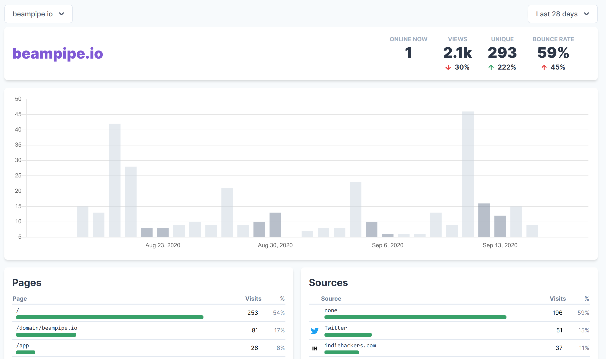

# Beampipe

Simple, privacy-focussed web analytics. No cookies. GDPR/CCPA compliant. Free for small sites.

Try it at [beampipe.io](https://beampipe.io) or check out the [live demo](https://app.beampipe.io/domain/beampipe.io).



## Features

- **Privacy-first** — no cookies, no personal identifiers, fully GDPR/PECR/CCPA compliant
- **Lightweight tracker** — tiny script that won't slow down your site
- **Real-time dashboard** — filter by source, region or time period
- **Goal & conversion tracking** — record custom events via our JavaScript SDK
- **Slack integration** — daily/weekly reports and event notifications
- **GraphQL API** — query and export your data on demand
- **Free tier** — up to 10k page views/month at no cost

## Architecture

The backend is written in [Kotlin](https://kotlinlang.org) with [Micronaut](https://micronaut.io) and stores data in [PostgreSQL](https://www.postgresql.org) + [TimescaleDB](https://www.timescale.com).

The dashboard UI is a [React](https://react.dev) + [TypeScript](https://www.typescriptlang.org) SPA built with [Vite](https://vite.dev) and [Tailwind CSS](https://tailwindcss.com).

The marketing site and docs are static [Astro](https://astro.build) sites deployed to Cloudflare Pages.

## Self-hosting

The quickest way to run beampipe locally:

```sh
curl https://raw.githubusercontent.com/scalar-dev/beampipe/master/docker-compose.yml -o docker-compose.yml
docker compose up
```

This launches TimescaleDB and beampipe. Access the UI at `http://localhost:8080`.

Docker images are on Docker Hub:
- [scalardev/beampipe](https://hub.docker.com/r/scalardev/beampipe) — server + UI
- [scalardev/beampipe-ui](https://hub.docker.com/r/scalardev/beampipe-ui) — UI only (for k8s)

## Development

Prerequisites: [Bun](https://bun.sh)

```sh
bun install   # install all workspace dependencies
```

### Marketing site (`web/`)

```sh
cd web
bun dev       # http://localhost:4321
```

### Dashboard (`ui/`)

```sh
cd ui
bun dev       # http://localhost:5173
```

### Docs (`docs/`)

```sh
cd docs
bun dev       # http://localhost:4321
```

Docs are live at [docs.beampipe.io](https://docs.beampipe.io).

## Links

- [beampipe.io](https://beampipe.io)
- [Documentation](https://docs.beampipe.io)
- [Blog](https://beampipe.io/blog)

Built and sponsored by [Scalar](https://www.scalar.dev).
